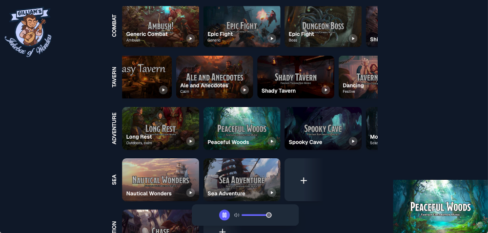

# Gilliam's Jukebox of Wonders

Manage and play a collection of YouTube music videos, organized into categories. 
Easily switch between videos to match the atmosphere of your RPG scenes.

[Click here to visit the "Jukebox"](https://brammeerten.github.io/gilliams-jukebox-of-wonders/)

## Features

- Add / remove music videos from YouTube.
- Label the videos.
- Organize the videos in different categories.
- Play / pause the video in background (hotkeys `space` or `k` to play/pause).
- Videos are automatically saved in your browser.

## Who's Gilliam?

**Gilliam P. Frost** is an adventurer, musician, and writer.
He travelled all the way from Waterdeep to Barovia, where — alongside his party, **The Mistfits** — he helped bring down lord Strahd von Zarovich.

While his adventuring skills are... debated (especially by his own party), his success as a writer is undeniable. His biggest bestseller? 
_“Lust Under the Full Moon: Lycan Passion (Lyrielle’s Temptation)”_ — a steamy tale of love, danger, and fur.

## TODO

#### Refactor / bugfixes

- [x] Cleanup css files & tailwind classes
- [x] Restructure directories (components, ...);
- [x] Check responsive design
- [x] Key errors
- [x] Linting & styling
- [ ] Listen for youtube events to better sync state
- [ ] Optimize image resolution for externam (yt) images.
- [ ] Add option to use youtube api instead of noembed
- [ ] Media vs music vs tile

#### Functionality

- [x] Add category indicators
- [x] Keyboard shortcuts
- [x] Add music
- [x] Delete music
- [x] Add category
- [x] Delete category
- [x] Reorder music and drag to different category
- [x] Drag media controls
- [x] Title and favicon
- [x] Make public
- [ ] Better default library
- [ ] Add info menu (and optional welcome menu?)
- [x] Save in local storage
- [ ] Export/import save file
- [x] Confirm dialog when removing category with tiles

#### Bugfixes

- [x] Drag tile to empty category
- [x] Don't harcode youtube thumbnail url, doesn't work for every video
- [x] Weird spacing at bottom page
